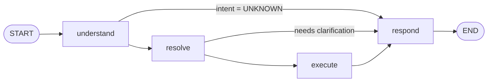
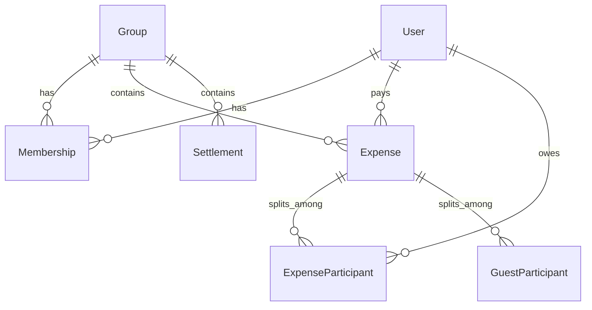

# Architecture

How LunchLedger AI is put together, and why. For running it, see [README.md](README.md).

---

## The one rule

> **The AI understands. Deterministic code computes. The database stores.**

A language model is excellent at reading *"Ali paid 1800 for himself and me"* and
terrible at being trusted with someone's money. So the model is given exactly one job —
turn a sentence into a structured `Extraction` — and is then removed from the process.
It never sees a balance, never performs a split, never issues a query.

Everything downstream of the extraction is ordinary, testable, deterministic
TypeScript. Re-run the same message against the same database and you get byte-identical
rows, whichever model produced the extraction.

This is the constraint the rest of the design exists to protect.

---

## Layers

```
┌─────────────────────────────────────────────────────────┐
│  apps/api          Fastify · terminal REPL · smoke test │
├─────────────────────────────────────────────────────────┤
│  packages/ai       LangGraph nodes  →  Tool Layer       │
├─────────────────────────────────────────────────────────┤
│  packages/core     Services (business logic) · DI root  │
├─────────────────────────────────────────────────────────┤
│  packages/db       Repositories · Prisma client         │
├─────────────────────────────────────────────────────────┤
│  packages/shared   Types · Zod schemas · money          │
└─────────────────────────────────────────────────────────┘
```

Dependencies point one way only: `api → ai → core → db → shared`. Nothing below
reaches up.

### How the boundary is enforced

The rule "AI nodes call tools, never services, never Prisma" is not documentation — it
is a type error. Every node is built by a factory that receives `AgentDeps`:

```ts
// packages/ai/src/nodes/deps.ts
export interface AgentDeps {
  extractor: Extractor;
  tools: Tools;
  // no services, deliberately
}
```

There is no `services` field, so a node physically cannot reach the business layer,
let alone the ORM. Adding a capability to the graph means adding a tool — which is the
point at which someone reviews it.

`packages/ai` also has no dependency on `packages/db` at all. The one type it needs
(`GroupMember`) is re-exported through `core`.

---

## The graph

Four nodes, one LLM call, deterministic routing.



Assembled in [`graph/buildGraph.ts`](packages/ai/src/graph/buildGraph.ts).

### understand — the only LLM call

Fetches the group's members, hands them to the model as context, and asks for one
structured object. Zod-validated on the way out, then re-validated defensively
(`ExtractionSchema.parse`) because model output is never trusted by shape alone.

Two things it is forbidden to do, stated explicitly in the system prompt: compute
anything, and resolve a date. It captures the *phrase* `"last week"`, not a timestamp.

### resolve — deterministic interpretation

Pure functions, no writes. Maps spoken names to member ids, resolves `me`/`myself`/`I`
to the current user, turns `dateText` into real dates, and decides whether the message
can proceed at all.

Participant modes come from the extraction and are expanded here:

| Mode | Meaning | Resolves to |
| --- | --- | --- |
| `all` | "everyone", "all of us" | every member |
| `all_except` | "everyone except Hamza" | members minus `excluded` |
| `only` | "only Ali and Ahmed" | exactly `names` |
| `unspecified` | not stated | every member |

A name matching no member becomes an `unknownName`, which short-circuits the graph to a
clarification rather than guessing. Notably this applies to *exclusions* too — "everyone
except Bilal" must not silently charge the whole group.

### execute — dispatch to the Tool Layer

A `switch` on intent, each branch calling one tool. All money and persistence happen
behind those tools.

`DomainError`s are caught here and converted into user-facing clarifications, so a
business-rule violation ("Ali is already in this group") becomes a helpful sentence
rather than a 500. Anything else rethrows — unexpected failures should be loud.

### respond — deterministic templates

Renders the typed `ExecResult` union into a reply string. No second LLM call: the
output is reliable, free, instant, and works offline. An optional polish pass is an
easy future addition, but the current behaviour is a deliberate trade.

### State

Channels flowing through the graph ([`state/graphState.ts`](packages/ai/src/state/graphState.ts)):

| Channel | Written by | Purpose |
| --- | --- | --- |
| `message`, `groupId`, `currentUserId`, `currentUserName`, `now` | caller | inputs |
| `extraction`, `intent` | understand | what the user meant |
| `resolved` | resolve | concrete ids, dates, ranges |
| `clarification` | resolve / execute | a question to ask instead of acting |
| `data` | execute | typed `ExecResult` |
| `reply` | respond | the string the user sees |

Each node writes only the channels it owns. `now` is injected rather than read from the
clock inside nodes, which is what makes date resolution testable.

**There is no checkpointer.** Each `agent.run()` is an independent invocation with no
memory of the last. This is the project's main structural gap — see
[Known gaps](#known-gaps).

---

## The extraction contract

[`packages/shared/src/extraction.ts`](packages/shared/src/extraction.ts) is the only
interface between the model and the rest of the system. Everything the AI is allowed to
say fits in it: `intent`, `amount`, `payer`, `participantMode`, `names`, `excluded`,
`settleFrom`, `settleTo`, `targetName`, `dateText`, `description`.

The schema is deliberately forgiving of small-model quirks — `""` coerced to `null`,
a bare or comma-joined string coerced to an array — because a free model returning
`"Hamza, Ali"` instead of `["Hamza", "Ali"]` should not fail a request.

> ### Trap: never share a Zod instance between fields
>
> `optionalName()` and `nameList()` are **factories**, and must stay that way.
>
> `withStructuredOutput` converts this schema to JSON Schema, and the converter
> deduplicates by object identity. Reuse one instance across `payer` and `settleFrom`
> and the second becomes a `$ref` pointing at the first. Gemini's `response_schema`
> rejects `$ref` outright with a 400 — while OpenRouter and the offline mock keep
> working, so the breakage looks provider-specific and mysterious.
>
> A fresh instance per field keeps the emitted JSON Schema fully inlined.

---

## Determinism

### Money is integers

All amounts are stored and computed as **minor units** — paisa, cents. The user and the
model speak in whole units (`2500`); the database and every calculation speak in minor
units (`250000`). Floating point never touches a balance.

### Splitting is exact

```ts
splitEqually(250000, 3) // → [83334, 83333, 83333]
```

The base share is floored and the indivisible remainder is handed to the earliest
participants, one unit each. The returned shares **always sum exactly to the total** —
no rounding drift, no vanishing paisa. Participant order is stable (members in resolved
order, then guests), so the same input always produces the same assignment.

### Balances are derived, never stored

There is no mutable `balance` column. For each member, on every read:

```
balance = paidInExpenses − sharesOwed + settlementsPaid − settlementsReceived
```

Positive means owed money, negative means owes. Computed in
[`BalanceService`](packages/core/src/services/balance.service.ts) from four aggregate
queries.

A stored balance is a cache, and caches drift — one failed write and the numbers are
quietly wrong forever. Deriving from the ledger makes drift structurally impossible.

### Dates resolve twice, deterministically

The model captures a phrase; `packages/core/src/date.ts` interprets it — in two
different ways depending on what the sentence is for:

| Function | Used for | `"last week"` → |
| --- | --- | --- |
| `resolveDate` | when an expense occurred | falls back to `now` (a range isn't a point) |
| `resolveDateRange` | which period to list | `Mon 00:00 … Sun 23:59:59.999` |

One extraction field, two readings, both pure functions of `(text, now)`. Weeks start
Monday. Unrecognised text yields `null` from `resolveDateRange`, so history lists
everything rather than silently filtering to nothing — and the reply only names a
period when one was actually applied.

---

## Data model



Every `Expense` stores `amountMinor` plus one row per participant holding that
participant's `shareMinor`. The shares are persisted rather than recomputed, so an
expense means the same thing forever even if membership later changes.

`GuestParticipant` models someone who joins for exactly one meal and owes their share to
the payer without becoming a member. **The table and the arithmetic are complete and
correct; nothing populates them yet** — see below.

---

## Error handling

`DomainError` carries a code (`VALIDATION`, `NOT_FOUND`, `CLARIFICATION_NEEDED`) and a
message written to be read by a human. Services throw it; the execute node catches it
and turns it into a clarification. The HTTP layer reports `success: false` with the
question in `reply`.

Everything else propagates as a genuine error. The distinction matters: "you forgot to
say how much" and "the database is unreachable" should not look the same.

---

## Providers

`createProviderModel(env)` picks OpenRouter → Gemini → mock by which keys are set. Both
real providers go through the same `withStructuredOutput` path, so adding a third is a
few lines.

The **mock** ([`llm/extractor.ts`](packages/ai/src/llm/extractor.ts)) deserves more than
"fallback". It is a genuine heuristic parser — intent detection, payer detection,
participant modes, name recognition, date phrases — producing the identical `Extraction`
shape. Because it exists:

- the test suite runs with no key, no network, and no flakiness
- CI needs no secrets
- a demo works on a plane, or after you have burned the day's free quota
- graph and business-logic bugs are debuggable without a model in the loop

It is not trying to be a language model. It is trying to make everything *except* the
language model testable.

---

## Testing

| Layer | How |
| --- | --- |
| Money, splits | Unit tests on pure functions |
| Participant resolution | Unit tests over a fixed member list |
| Date and range resolution | Unit tests against a frozen `now` |
| Language understanding | Mock extractor asserted against every example in the spec |
| Full stack | `pnpm smoke` — real graph, real database, real balance assertions |

45 unit tests run in about two seconds with no external dependencies. The smoke test
builds an isolated fixture group, drives the agent through add → balance → subset split
→ settle → clarify → history → membership, asserts the numbers directly against the
database, and cleans up in a `finally`.

Date tests construct `Date` objects from parts and compare local calendar days, so they
pass in any timezone.

---

## Adding an intent

The layering makes this mechanical:

1. Add the name to `INTENTS` in `packages/shared/src/intents.ts`.
2. Describe it in the system prompt (`prompts/extraction.prompt.ts`) and teach the mock
   parser to recognise it, so the offline path keeps working.
3. If it needs new business logic, add a service method in `packages/core` — and a
   repository method in `packages/db` if it needs new data access.
4. Expose it as a tool in `packages/ai/src/tools/index.ts`.
5. Add a `case` to the execute node, and a variant to the `ExecResult` union.
6. Add a `case` to the respond node. The union is exhaustive, so TypeScript will tell
   you if you forget.
7. Test the pure parts as unit tests; add a smoke assertion if it touches the database.

Note step 6: `ExecResult` being a discriminated union means an unhandled intent is a
compile error, not a silently empty reply.

---

## Known gaps

Honest list, roughly by impact.

**No conversation memory.** The largest one. Without a checkpointer and a thread id,
every message starts from zero — so the agent can ask *"add Bilal temporarily or
permanently?"* and then cannot hear the answer. This is why the guest tables are
unreachable, and why follow-up questions don't work. Fixing it is a contained change:
compile the graph with a checkpointer, thread an id through `agent.run()`, and add a
`pendingClarification` channel that `understand` consults before treating a message as
fresh.

**No frontend.** `apps/web` is unwritten.

**Group is not part of the language.** `ExtractionSchema` has no group field; the group
comes from config or the request body. Multi-group users cannot switch by voice.

**Analytics intents are missing.** "How much do I owe Ali?" degrades to a full balance
table; "who spent the most this month?" has no path at all.

**Adding a member matches on name.** With no auth, a name is the only identity available,
so two different people called Bilal cannot be distinguished. Reusing an existing user is
the right default for the domain — the same friend really is in several groups — but it
is an assumption, not a fact.

---

## Deliberate deviations from the spec

The original brief ([`readme`](readme)) asked for a few things this implementation does
differently, on purpose.

**Tools are typed functions, not model-bound LangChain tools.** The spec asked for tool
calling. Here the model chooses an *intent* and a `switch` chooses the tool. This keeps
return types fully typed end to end and keeps a hallucinated tool call from touching
money. The honest trade-off: it demonstrates structured output rather than tool calling.
If tool calling is wanted for its own sake, bind it for the read-only analytics intents,
where a wrong choice costs a bad answer instead of a corrupted ledger.

**Responses are templates, not generated.** The spec put response generation under the
AI's responsibilities. Templates are deterministic, free, offline-capable, and cannot
hallucinate a number that contradicts the database.

**Intent detection and entity extraction are one node, not two.** One model call instead
of two, for the same result at half the latency and cost.

**`packages/core` exists**, beyond the spec's `ai`/`db`/`shared`. Without it, business
logic has nowhere to live that isn't the AI layer or the ORM layer.
